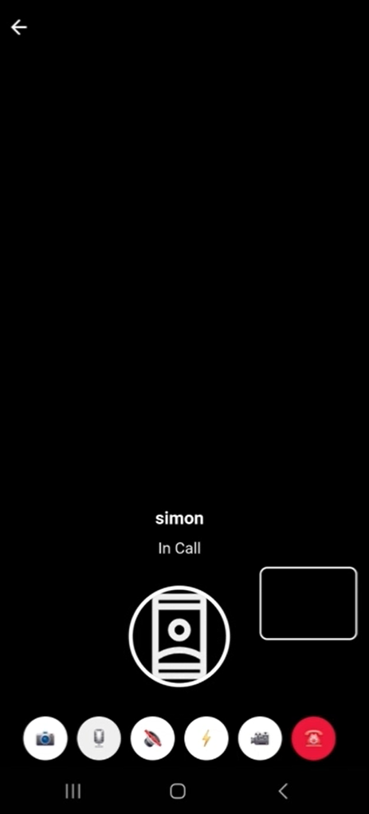
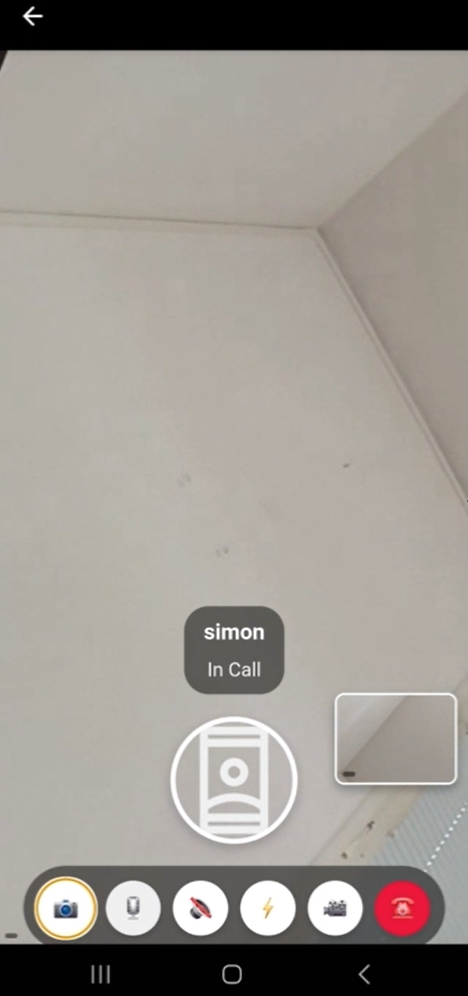
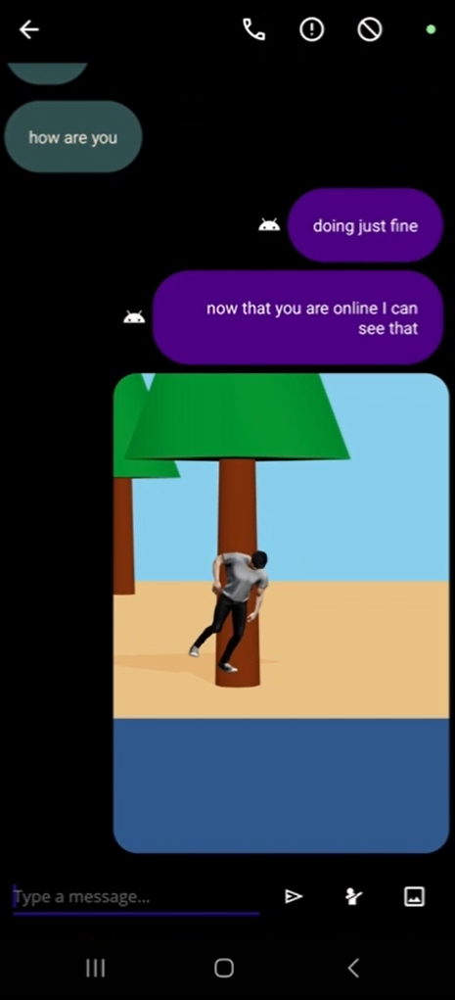

A chat app with video calls - VideoChat, VideoCalls

### For full code contact
simonbinyamin@gmail.com







### To test the app
Download Chitgab from Google Play

### Video calls 
Currently only working when two devices are on the same wifi since we have disabled PEERServer


### Make Android-to-Android calls using the Chitgab app

### Make PC-to-Android or PC-to-PC calls using our API
to make PC-to-Android or PC-to-PC calls first make a POST Request to

```
https://chatbe1285.azurewebsites.net/api/auth/Login

body {
    "Username": "your_username",
    "HashedPW":"your_PW", // Plainttext NOT hashed
    "DeviceId":"" //Leave empty
}
```

Once you have the Bearer token simply open our frontend and insert it as a Cookie

```
URL: https://chatfe5415.azurewebsites.net/call/
Cookie
sessionId: ebeayJhbGciO....
```

In order to make a call you have to define your username and the target username in a querystring
if however you are receiving a call only your username is needed

```
https://chatfe5415.azurewebsites.net/call/?key=adam&callerkey=brian //call someone
https://chatfe5415.azurewebsites.net/call/?key=adam //receiving a call
```

 
# Technical Architecture
### Client Layer (Android) 
Built with .NET MAUI in C# and .NET9.

### Backend Layer (.NET 8 & SignalR)
SignalR Hubs for real‑time messaging and presence updates.

### GLB files 
Hosted in Cloudflare R2 with caching headers in serverside


### ChitGab studio/Rendering the glb files in webview
ThreeJS and javascript is used to both render the running glb file inside a webview but also to generate the right avatar or environment using ChitGab studio  

### Real‑Time Data & Messaging (Firebase)
Firebase Realtime Database buffers undelivered messages

### Media & VideoCall Infrastructure (WebRTC + JS)
Signaling over SignalR, peer connections via WebRTC, The MAUI client load an azure app that has the running webrtc inside Javascript

### Authentication & Security
JWT tokens for session management. HTTPS/TLS enforced throughout.


# Breaf
Our ChatApp is a cutting‑edge Android messaging platform designed to blend traditional messaging and calling capabilities with immersive 3D avatar interactions. Leveraging a robust C#/.NET 9 core, SignalR real‑time synchronization, WebRTC media streaming, and Three.js‑powered GLB rendering, it offers users rich, interactive experiences—making it a highly attractive acquisition or partnership opportunity for major players.

# Core Functionality
## Register/Login
User authentication is a crucial aspect, especially when the backend involves secure communication and persistent sessions. One widely adopted approach is the use of JSON Web Tokens (JWTs) in combination with refresh tokens to manage and secure user sessions. The process begins when a user initiates a login through the MAUI client application.The user provides credentials, a username and password. These credentials are then securely sent to the server via HTTPS to ensure that sensitive data is protected in transit.
On the server side, an ASP.NET Core Web API, the credentials are verified against a user store.If the credentials are valid, the server proceeds to create a set of claims. These claims represent pieces of information about the user, such as their user ID, email, roles, or any other relevant data. These claims are then encoded into a JWT, which serves as a token that the client can use to authenticate itself in subsequent API requests. This JWT is signed using a secret key HMACSHA256. The JWT contains metadata such as an expiration time, an issuer, and an audience, along with the payload comprising the claims.
The entire architecture relies on maintaining stateless authentication with JWTs and secure session renewal using refresh tokens. It combines the speed and scalability of token-based auth with persistent sessions enabled by refresh tokens, all while keeping the user experience smooth. Security is maintained by short-lived access tokens.


## Encryption of messages
RSA (Rivest–Shamir–Adleman) is a widely used public-key cryptographic algorithm that ensures secure communication over untrusted networks such as the internet. It works on the principle of key pairs: a public key that can be shared with anyone and a private key that is kept secret. The core idea behind RSA is to allow encryption using the recipient’s public key so that only the intended recipient, who has the corresponding private key, can decrypt the message. In the context of a chat app, RSA can be used to secure messages while they are in transit, ensuring that only the intended recipient can read them even if the messages are intercepted.
In Chitgab, when one user wants to send a message to another, they first obtain the recipient’s public key. Using this public key, the message is encrypted so that only the corresponding private key can decrypt it. This means that even if a third party intercepts the encrypted message, they cannot read its content without access to the private key.
3D Stickers
The chat application is designed to allow users to share and view 3D GLB files seamlessly within a web-based environment, leveraging a WebView interface. This setup enables the application to be integrated into mobile platforms or embedded contexts without relying on traditional browser-based navigation. The entire system is hosted through a link served on Microsoft Azure, which ensures scalable and reliable delivery of frontend and backend services. The architecture is designed for efficiency and on-demand access to 3D content, allowing users to exchange rich visual information without requiring the recipient to download or store files manually.
The application operates by passing a query string in the URL, which serves as a reference or key for the requested content. This query string is used by the frontend to initiate a request to the backend server. The backend is responsible for resolving this key, locating the corresponding GLB file, and serving it efficiently. This on-demand approach ensures that only the necessary files are loaded as needed, reducing bandwidth consumption and improving overall performance. Additionally, the backend includes a caching mechanism. Once a GLB file is requested and retrieved, it is cached so that subsequent requests for the same file can be served more quickly. This minimizes redundant operations and improves load times for end-users, especially in scenarios where a particular model may be shared frequently.
On the frontend, rendering the 3D content is handled by Three.js, a powerful and widely used JavaScript library for 3D graphics. Three.js allows the application to load, parse, and render GLB files directly within the browser context of the WebView. Once the GLB file is fetched via the backend API, the frontend uses the Three.js GLTFLoader to parse the file and create a visual representation within a scene. The application sets up a basic rendering loop with a camera, lights, and scene environment, providing users with interactive controls such as zooming, panning, and rotating the 3D model. This interactivity enhances user engagement and allows for detailed inspection of shared 3D assets.
Security and efficiency are also considered in the design. Since only a query string is passed to the frontend, direct access to file paths or sensitive backend logic is prevented. The backend controls access and ensures that only authorized or valid requests result in file delivery. Additionally, by centralizing the caching on the server side, the application reduces the burden on client devices and avoids unnecessary repetition in file transfers.
Overall, this system provides a lightweight, scalable, and interactive solution for sharing and viewing 3D models in a chat context. By combining cloud-hosted services, query-based routing, on-demand backend loading with caching, and Three.js-powered rendering, the application offers a smooth and user-friendly experience. It is particularly useful in domains such as product visualization, collaborative design review, or educational contexts where sharing rich 3D content is valuable. The modular design also allows for future enhancements, such as authentication, file annotations, or model versioning, without major architectural changes.


## Friend Discovery & Management

The chat application is designed to enable users to connect, communicate, and build relationships in a secure and user-friendly environment. Upon logging in or signing up, users can access a search feature that allows them to look for other users by name, username. Once a user finds someone they would like to connect with, they can send a friend request. This request is delivered to the recipient, who can either accept or decline it. A connection is only established when the request is accepted, ensuring that both parties consent to becoming friends. Once the friend request is accepted, both users are added to each other's friend lists, and a communication channel is opened between them. This setup creates a two-way relationship model where messages can be exchanged only between confirmed friends, promoting privacy and reducing spam or unwanted messages.
Behind the scenes, the app maintains a database of users, friend requests, and established friendships. When a request is sent, it is stored as a pending request, and the recipient is notified. If accepted, the status changes and the system registers both users as friends. The messaging system becomes accessible after this confirmation, allowing real-time chatting between users through a user interface that supports text-based communication.
The friend request system is a core part of the social interaction model, acting as a gatekeeper to control who can engage in conversations with whom. It helps establish trust and ensures mutual agreement before interaction begins. The app may also include features such as notifications and friend list management to enhance usability. These functionalities work together to create a seamless experience where users can easily find and connect with others while maintaining control over their interactions. 

## Invite users from contact list
In our chat application, we have implemented a seamless and user-friendly referral and social connection feature that enhances user engagement and encourages organic growth. When a user taps on the "Invite Friends" option within the app, they are presented with access to their device’s contact list. This integration allows users to easily browse through their contacts and choose whom they wish to invite. Once a contact is selected, the app generates a unique download link that can be shared through any preferred messaging or social platform, including SMS, email, or third-party chat apps. This link directs the invited person to download and install the chat application on their device. The process is designed to be smooth and efficient to minimize friction in onboarding new users.
When the invited person installs the app using the referral link, the system automatically detects that the installation came through a specific user’s invitation. As soon as the installation and initial setup are complete, a real-time notification is sent to the original user, informing them that their friend has successfully joined the platform. This notification serves as a prompt for the original user to reach out, enhancing the chances of immediate engagement and communication within the app. The user can then choose to send a friend request to the newly joined contact directly from the notification or within the app’s contact interface.
This flow not only creates a direct and meaningful connection between users but also fosters a sense of community within the app. By giving users the ability to instantly interact with people they already know, it increases retention and encourages active usage. Additionally, the feature acts as a built-in growth mechanism by incentivizing users to invite their existing network. The implementation ensures data privacy by only accessing the contact list with the user's permission and without storing personal data on external servers. Overall, this feature streamlines the process of building one’s network within the chat app, turning every user into a potential ambassador and significantly contributing to user acquisition through word-of-mouth and social sharing.


## Video Calling
Leveraging WebRTC for media transmission and JavaScript for user interaction and signaling logic. Chitgab uses a WebView to acts as a bridge between the native mobile or desktop environment and the web-based interface, allowing you to maintain a consistent user experience while embedding advanced capabilities within your app. WebRTC (Web Real-Time Communication) is the core technology used to establish peer-to-peer audio connections directly between users. It handles the streaming of video/audio and data in real time, with minimal latency and no need for intermediary media servers for most direct connections. To facilitate the setup of these peer-to-peer connections, the application employs SignalR as the signaling mechanism. SignalR is a real-time communication library provided by Microsoft that enables server-client communication via WebSockets or fallback techniques. the application (The web app and mobile client) handles the exchange of metadata such as session descriptions (SDP), ICE candidates, and other control messages necessary to initiate and maintain WebRTC connections. When a user initiates a call, the web application first gathers the local media streams using the WebRTC getUserMedia API, then creates an offer SDP describing the media parameters. This offer is sent through SignalR to the target user. The receiving user, upon accepting the call, sends an answer SDP back using the same signaling channel. ICE candidate messages are also exchanged to determine the most efficient route for media between peers. Once signaling is complete and connectivity checks are successful, a direct media stream is established between users.